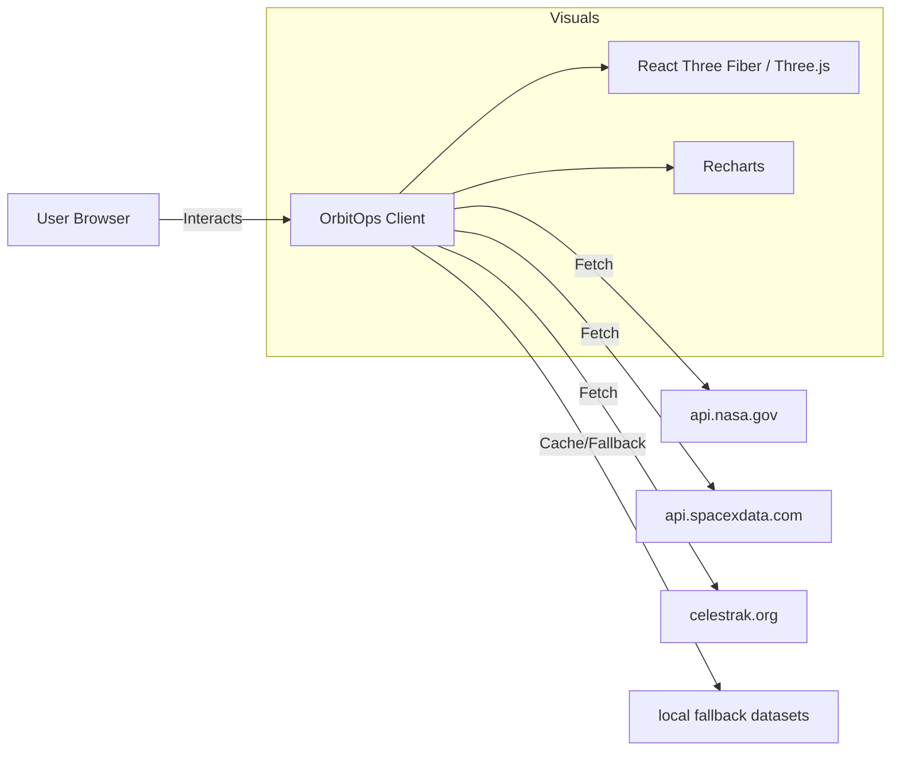

**OrbitOps Telemetry Dashboard**

  

A production-grade React dashboard that consolidates public aerospace telemetry into a mission-control style operations console. The app combines time-series charts, space-weather telemetry, and interactive 3D orbital visualizations to present launches, near-earth objects, satellite constellations, and planetary media in a single operational view.

## Purpose

OrbitOps unifies public space data sources (NASA, SpaceX, CelesTrak) into a resilient, client-side operations dashboard. It is optimized for telemetry observability: dense panels for quick situational awareness, fallback data when feeds degrade, and WebGL canvases for interactive orbital context.

Design goals:
- Provide high-density, low-latency telemetry views for operations teams.
- Surface degraded-stream and fallback states visibly.
- Keep the client static and privacy-safe (no user accounts or private server secrets).

## Core Features

- Mission Control: SpaceX launch timeline, launch history charts, and landing/reentry metrics.
- Deep Space: NASA APOD gallery, Mars rover imagery, and historical date replay.
- Space Weather: DONKI CME / flare / geomagnetic storm integration and alerts.
- Orbit Globe: Interactive 3D orbital visualization and constellation shells (Starlink, OneWeb, etc.).
- Fleet Tracker: CelesTrak active catalogue with client-side caching and graceful fallback to local datasets.
- Chronos Timeline: Year-slider replay of historical telemetry for forensic analysis.
- Resilience: Built-in local fallbacks and cache layers to keep the UI functional under degraded network conditions.

## Tech Stack

- Vite
- React (client-only)
- React Router DOM
- Tailwind CSS
- Lucide React icons
- Recharts for charts
- Three.js + React Three Fiber + Drei for 3D scenes

## Getting started

Prerequisites: Node.js 18+ recommended, npm 9+.

Install dependencies:

```bash
npm install
```

Run development server:

```bash
npm run dev
```

Build for production:

```bash
npm run build
```

Preview production build locally:

```bash
npm run preview
```

## Environment variables

All `VITE_*` variables are bundled into the client and therefore public. Use hosting provider environment variables (Vercel, Netlify) rather than committing `.env` files.

| Variable | Required | Description |
| --- | ---: | --- |
| `VITE_NASA_API_KEY` | Recommended | NASA API key used for APOD, NeoWs, DONKI, EPIC, and Mars Rover APIs. The app falls back to `DEMO_KEY` if omitted, but rate limits apply. |
| `VITE_BASE_PATH` | Optional | Base path for deployment (use `/` for root). |

Local developer tip:

```bash
# create local env (do NOT commit)
cp .env.example .env.local
# edit .env.local and set VITE_NASA_API_KEY
```

## Deployment (Vercel recommended)

Quick Vercel setup:

1. Push the repo to GitHub.
2. Import the project on Vercel and set the framework preset (Vite).
3. Set environment variables in Vercel dashboard: `VITE_NASA_API_KEY`.
4. Build command: `npm run build`, Output directory: `dist`.

Alternatively, use the Vercel CLI:

```bash
npm i -g vercel
vercel login
vercel --prod
vercel env add VITE_NASA_API_KEY production
```

Notes: keep `.env.local` out of version control; use Vercel environment variables for production keys.

## Data resilience and security notes

- Third-party feeds may rate-limit or block browser-origin requests; the app includes local fallbacks and client-side caching to remain usable under degraded conditions.
- Vite `VITE_*` variables are public once bundled — never store private server secrets in client envs.
- If a secret was accidentally committed, rotate it and remove it from git history (use `git filter-repo` or the BFG tool).

## Architecture (high level)



This diagram shows the client-side flow: the browser app fetches public APIs, renders charts and 3D scenes, and switches to local fallbacks when remote feeds fail.

## Known constraints

- Browser-origin requests may be blocked or rate-limited by target APIs. The app uses client caching and fallback datasets as a defensive posture.
- The 3D and charting dependencies increase bundle size; consider code-splitting heavy pages for faster initial loads.

## Contributing

Contributions are welcome. Please open issues or PRs for bug fixes and feature requests. Before submitting:

- Run `npm install` and `npm run build` locally.
- Ensure `.env.local` is not committed.

---

If you want, I can:
- run `npm audit` and open a PR that updates vulnerable dependencies,
- remove the local `.env.local` from the repo and add a safe README snippet for Vercel env setup.

Project file: [README.md](README.md)
